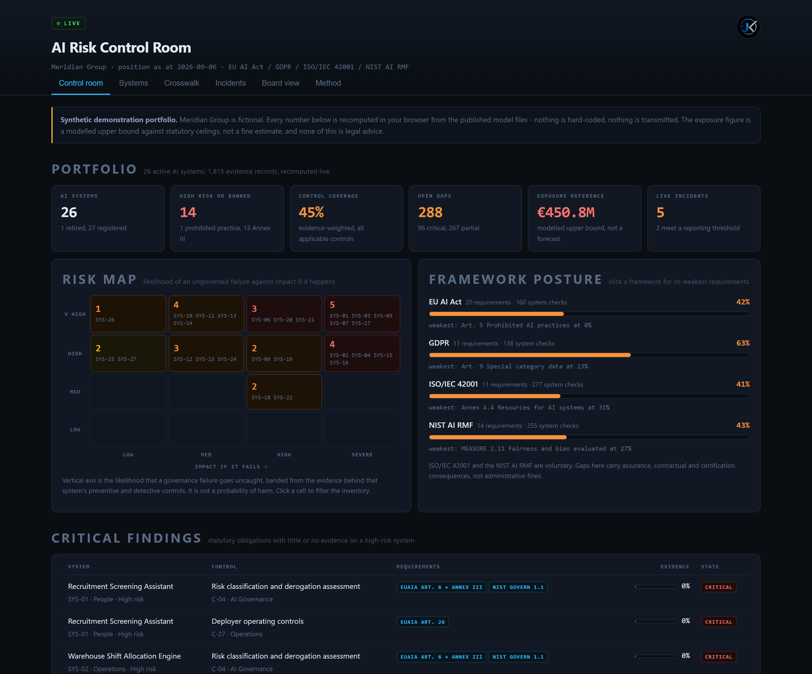
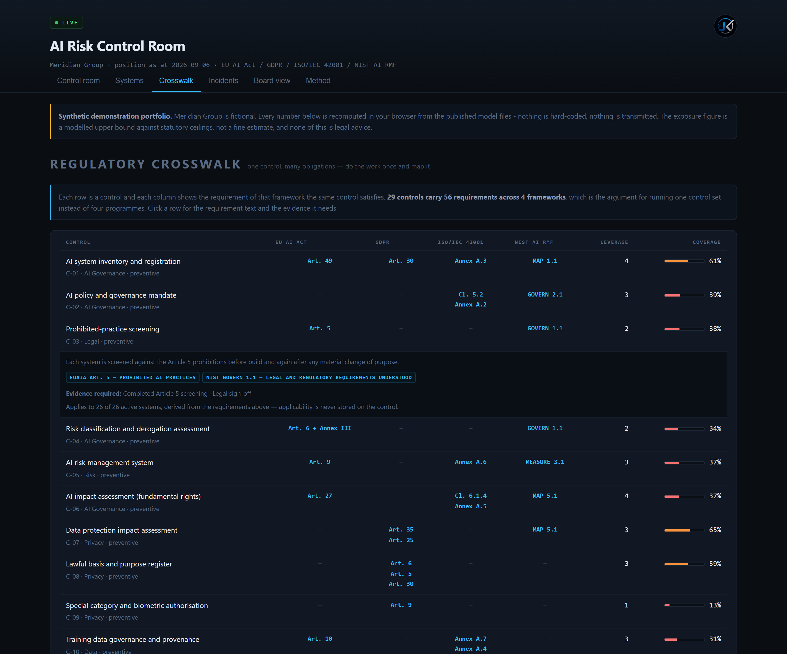
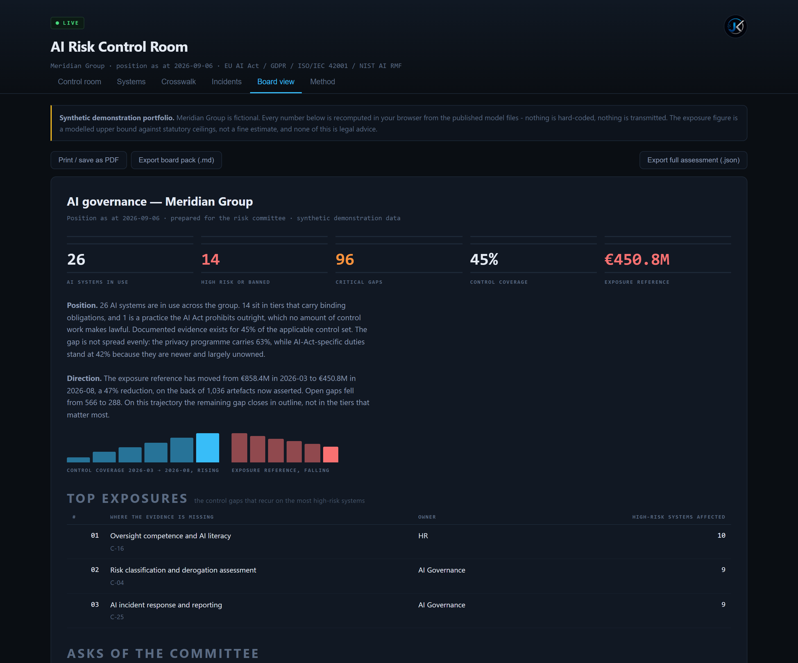
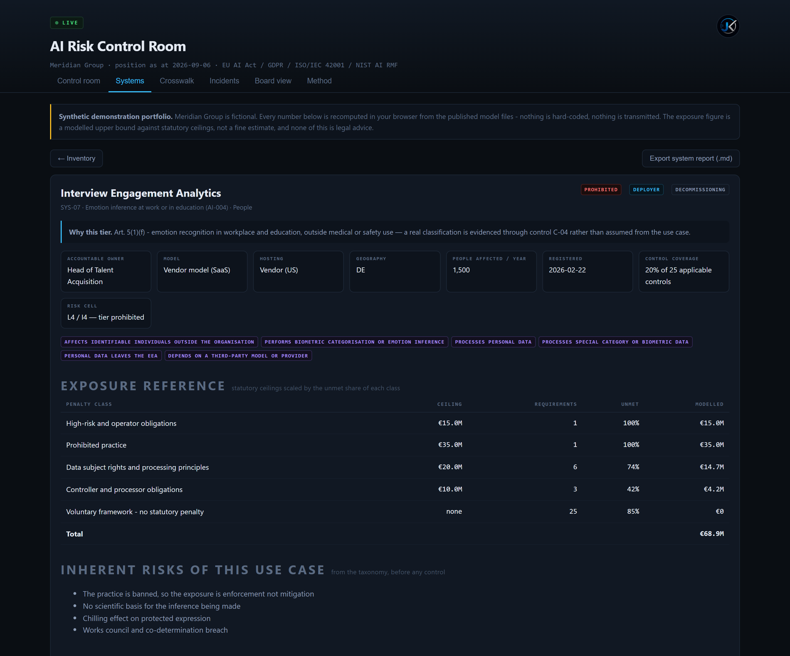
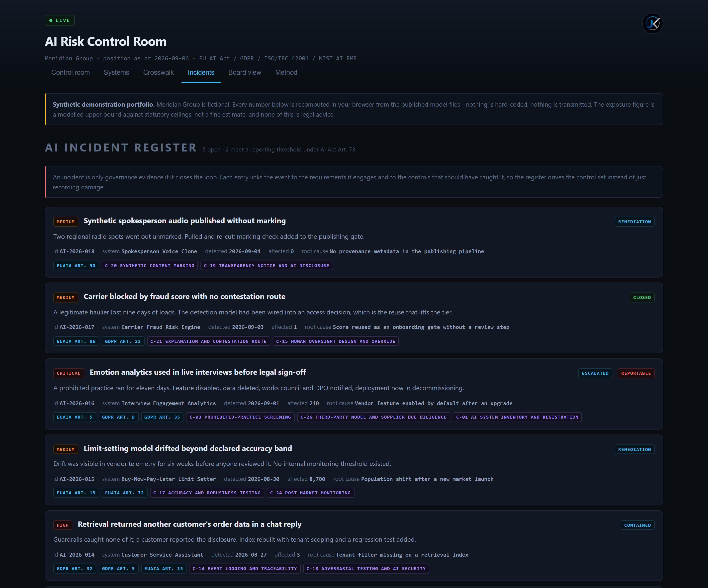

<p align="center"></p>

# AI Risk Control Room

A control room for an AI governance programme. It holds an inventory of AI systems, derives which
obligations each one attracts under the **EU AI Act, GDPR, ISO/IEC 42001 and the NIST AI RMF**,
tracks the evidence behind every control, and reports the result as risk, gaps, exposure and a
board pack.

**Two live pages, same engine:**

| | What it is |
|---|---|
| **[Demo control room](https://jeevan-0508.github.io/ai-governance-control-room/)** | A fictional 27-system organisation, already populated. Read the instrument at full scale. |
| **[Operator console](https://jeevan-0508.github.io/ai-governance-control-room/docs/live/)** | Empty. Register **your own** AI systems, record evidence, export the inventory as JSON. Saved in your browser only. |

It runs entirely in the browser against published JSON. No server, no account, no telemetry, and
no dependencies — five local scripts and two stylesheets.



## The question it answers

Most compliance tooling asks *are you compliant?* — a question no tool can honestly answer, because
compliance is a legal conclusion about a specific system. This asks the narrower question that an
auditor, a certification body or a market surveillance authority actually opens with:

> **Does documented evidence exist for the controls that carry each obligation, and who owns the
> ones that don't?**

Everything in the tool is built on that. A score is never an opinion about compliance; it is the
share of required evidence that exists, and you can click through from any number to the artefact
list behind it.

## What is in the model

| | Count | |
| --- | --- | --- |
| Frameworks | 4 | EU AI Act (Reg. 2024/1689), GDPR, ISO/IEC 42001:2023, NIST AI RMF 1.0 |
| Requirements | 56 | each cited to its article or clause, with a plain-language operational summary |
| Controls | 29 | each with an objective, an owner role, a type, and the evidence it needs |
| Evidence artefacts | 84 | policies, procedures, assessments, test reports, records, contracts |
| Crosswalk mappings | 70 | 22 of the 29 controls satisfy requirements in more than one framework |
| AI use-case classes | 14 | tier + the Annex III / Art. 5 / Art. 50 basis for that tier, indicators, inherent risks |
| Demo portfolio | 27 systems | 1,815 evidence records, 6 incidents, deterministically generated |

Every one of those numbers is checked by `scripts/validate_model.py`, which fails the build on a
dangling id, a requirement no control carries, a requirement in two penalty classes, or evidence
recorded against a control that does not apply to that system.

## The five things that make it more than a dashboard

### 1. Applicability is derived, never maintained by hand

A requirement applies to a system when every clause present in its `applies` block holds — role in
`roles`, tier in `tiers`, at least one `conditions` flag set on the system. A **control** applies
when at least one requirement it satisfies applies. That single rule means the crosswalk is the
only place obligations are declared: add a requirement to a control and the right systems pick it
up, with no applicability matrix to drift out of date. 26 active systems produce **930
(system, requirement) checks** from that rule alone.

### 2. One control, many regimes



Human oversight is not four projects. `C-15 Human oversight design and override` carries AI Act
Art. 14, GDPR Art. 22, ISO/IEC 42001 A.9 and NIST MANAGE 2.2 at once — so the evidence is produced
once and reported four times. Eight controls span three or more frameworks. The crosswalk view
shows that leverage explicitly, which is the whole argument for one control set instead of four
parallel programmes.

### 3. Exposure separates statutory teeth from posture

Each requirement sits in exactly one penalty class, and voluntary frameworks carry a ceiling of
**zero on purpose**. So the money figure only moves for obligations that can actually be enforced:

| Penalty class | Ceiling | Requirements |
| --- | --- | --- |
| Prohibited practice — AI Act Art. 99(3) | €35M / 7% turnover | 1 |
| High-risk and operator obligations — Art. 99(4) | €15M / 3% | 19 |
| Data subject rights and principles — GDPR Art. 83(5) | €20M / 4% | 7 |
| Controller and processor obligations — Art. 83(4) | €10M / 2% | 4 |
| ISO/IEC 42001 and NIST AI RMF | none — voluntary | 25 |

Exposure is then `ceiling × unmet share of that class's applicable requirements`, summed. It is a
**modelled upper bound for prioritisation, not a forecast of any fine** — that caveat is in the UI,
in both exports and in the JSON schema, not just in this README.

### 4. The trend is replayed from the data, not invented



Every evidence record carries the date it was asserted. The board view recomputes the whole
portfolio as at each month in that history, so the coverage line and the exposure line are
derivations rather than decoration. In the demo portfolio coverage moves 8% → 45% and the exposure
reference falls €858M → €451M across six months, and both numbers are checked by the test suite
against an independent recomputation.

### 5. The evidence trail is editable, and everything downstream recomputes



Open any system and you get its tier *with the legal basis for it*, its inherent use-case risks
before any control, its exposure breakdown, its incidents, and every applicable control with the
artefacts behind it. Flip an artefact between **present / partial / missing** and coverage, the
risk cell, the exposure, the framework posture and the remediation queue all move — which is what
makes it a working assessment tool rather than a report. Edits stay in your browser and are
reversible in one click.

## Two things that come from doing this work for real

**The remediation queue is ranked by effect, not by framework order.** For each gap the engine asks
what exposure disappears if that one control were fully evidenced, per system, and sums it. The top
of the queue is therefore whatever removes the most exposure across the portfolio — usually a
boring cross-cutting control like a lawful-basis register, not the most alarming-sounding one.

**Fraud detection is the interesting edge case.** Annex III(5)(b) expressly *excludes* AI used to
detect financial fraud from the high-risk credit-scoring category, so class `AI-013 Financial fraud
detection` is modelled as transparency-tier — but with the trap written into the taxonomy: the tier
rises to high the moment the same score is reused to decide access to credit, employment or an
essential service. The demo portfolio contains an incident that is exactly that failure, because in
practice it is how a detection model quietly becomes a decision system.



Incidents are not a separate log. Each one links to the requirements it engages and to the controls
that should have caught it, and the register then reports how well evidenced those controls actually
are across the portfolio — closing the loop from event back to control set.

## Screens

| | |
| --- | --- |
| **Control room** | portfolio KPIs, 4×4 risk map, framework posture with weakest requirements, critical findings, remediation queue |
| **Systems** | filterable inventory, then a system card with the full evidence trail |
| **Crosswalk** | controls × frameworks, with the leverage and coverage of each control |
| **Incidents** | register linked to requirements, controls and root cause |
| **Board view** | one-page committee pack, printable, with trend and explicit asks |
| **Method** | the maths, the sources, and what the tool refuses to claim |

Exports: board pack (Markdown), per-system governance report with an actionable evidence checklist
(Markdown), and the full assessment (JSON) for anyone who wants to check the arithmetic.

## Run it locally

```bash
git clone https://github.com/Jeevan-0508/ai-governance-control-room
cd ai-governance-control-room
python -m http.server 8813 --directory docs      # browsers block fetch on file:// URLs
```

Change the model, then:

```bash
python scripts/seed_portfolio.py                 # regenerate the demo portfolio
python scripts/validate_model.py --sync          # check every cross-reference, refresh docs/ copies
npm install puppeteer
node tests/assert.mjs      http://127.0.0.1:8813/   # the demo control room
node tests/assert-live.mjs http://127.0.0.1:8813/   # the operator console
```

## Tests

`tests/assert.mjs` runs **68 assertions** against the served page in headless Chrome. It is not a
snapshot suite: the KPI coverage figure, all four framework posture percentages, the heatmap
population, the crosswalk leverage total and the export contents are each **recomputed from the raw
JSON inside the test file, with no engine code involved**, and compared with what the page renders.
A rendering that quietly disagrees with the model fails the build. It also checks the filters, the
live recompute after an evidence edit, the localStorage override, the disclaimers, zero console
errors, and no horizontal overflow at 360 / 390 / 412 px.

`tests/assert-live.mjs` runs **36 assertions** against the operator console, driving it the way a
person does: boot, register a system from an empty inventory, check that the derived tier, legal
basis and requirement count match an independent recomputation, record an evidence artefact, reload
the page to prove it persisted, walk every view on a one-system portfolio, delete the system, load
the example organisation, and check 360 / 390 px for overflow.

`tests/screenshots.mjs` regenerates the images in this README from the live page, so they cannot
show a UI that no longer exists.

## What this is not

- Not a compliance certification, a legal opinion or legal advice.
- Not a probability of harm, of enforcement or of a fine. Coverage measures evidence, nothing more.
- Not a substitute for a classification assessment. The taxonomy tier is the tier a use case
  *normally* attracts; a real classification depends on the concrete system, which is why it is
  itself a control (`C-04`) that has to be evidenced.
- Requirement summaries are plain-language paraphrases for operational use, not legal text. Always
  read the cited source.
- The demonstration portfolio is fictional. Meridian Group, its systems, owners and incidents are
  invented, and no real organisation, person or event is described.

## Licence

Code: **MIT**. The requirement, control and taxonomy model in `data/`: **CC BY 4.0** — reuse it in
your own programme, with attribution.

---

Built by [Jeevan Siddhabhaktula](https://github.com/Jeevan-0508). Companion projects:
[Freight Fraud Taxonomy](https://github.com/Jeevan-0508/freight-fraud-taxonomy) ·
[Freight Risk Atlas](https://github.com/Jeevan-0508/freight-risk-atlas) ·
[EU AI Act Scanner](https://github.com/Jeevan-0508/eu-ai-act-scanner) ·
[GDPR Compliance Scanner](https://github.com/Jeevan-0508/gdpr-compliance-scanner)
